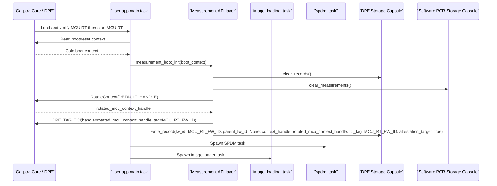
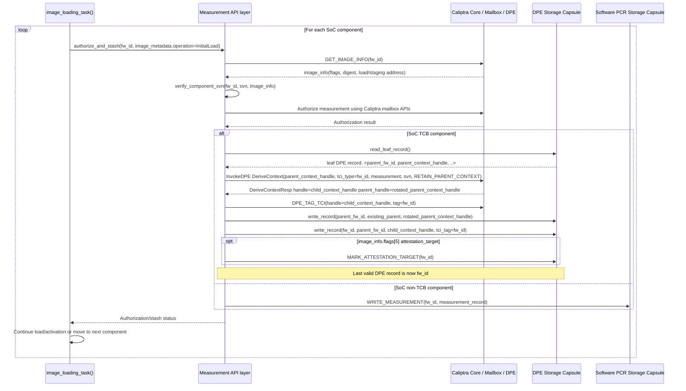
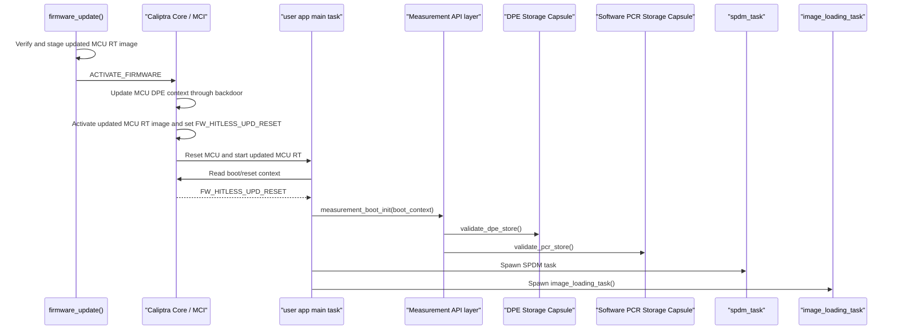
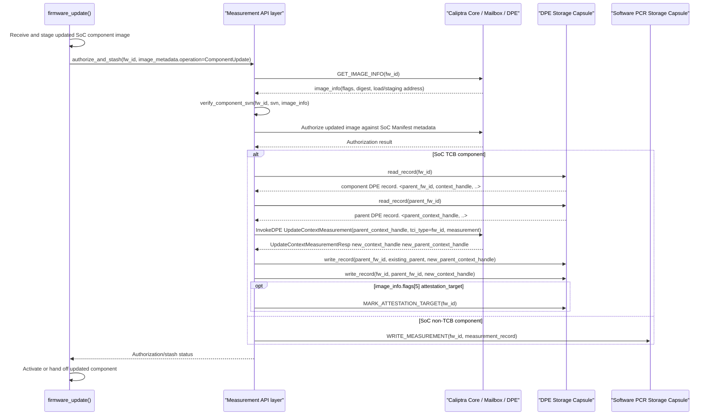

# Caliptra MCU Measurement & Attestation Design

## 1. Architectural Overview

This document defines the software design for collecting, storing, and reporting SoC firmware measurements and attestation claims on the Caliptra-enabled MCU Subsystem.

Caliptra Core is the Hardware Root of Trust and owns the DICE/DPE context chain. The MCU RT is loaded and verified by Caliptra Core and represented as a context in that DPE chain. The **SPDM responder in MCU Runtime (RT)** generates evidence in the form of an **Entity Attestation Token (EAT)** compliant with the **OCP EAT profile**. The SPDM responder assembles the EAT claims as the payload of a `COSE_Sign1` envelope and requests Caliptra Core to sign that envelope. To populate the EAT claims, MCU RT queries SoC TCB component measurements from Caliptra Core using DPE context handles and combines them with stashed SoC non-TCB component claims from MCU-managed storage.

```
+-----------------------+     +-----------------------+     +-----------------------+
| spdm_mctp_responder() |     | image_loading_task()  |     | firmware_update()     |
| spdm_doe_responder()  |     | initial authorize     |     | update authorize      |
| claims read path      |     | and stash path        |     | and stash path        |
+-----------------------+     +-----------------------+     +-----------------------+
           \                             |                                /
            \                            |                               /
             v                           v                              v
          +---------------------------------------------------------+
          |               Core Measurement API                      |
          | measurement_boot_init / authorize_and_stash             |
          | read_measurement / read_attestation_target_handle       |
          +---------------------------------------------------------+
                                  |
            +---------------------+---------------------+
            | (TCB Component)                           | (Non-TCB Component)
            v                                           v
+-----------------------+                   +-----------------------+
|  Caliptra Core DPE    |                   |  Software PCR Storage |
| (Via DPE Handle from  |                   |        Capsule        |
|  DPE Storage Capsule) |                   +-----------------------+
+-----------------------+                               |
            |                                           |
            | (DPE handle records)                      | (PCR records)
            +---------------------+---------------------+
                                  |
                                  v
                    +---------------------------+
                    |    Persistent MCU SRAM    |
                    | (Survives Hitless Update) |
                    +---------------------------+
```

To support this, the system leverages two dedicated kernel storage areas carved out in MCU SRAM and managed by **Tock Capsules** (kernel drivers) - both of which must survive MCU hitless updates (warm resets):
1. **DPE Storage Capsule:** Stores `fw_id`-keyed DPE context handle records.
2. **Software PCR Storage Capsule:** Stores stashed measurements/claims for non-TCB components.

---

## 2. Core Measurement API Design

The Userspace SDK provides a unified API wrapper that abstracts whether a component's claims reside in the **DPE context tree** or the **Software PCR Storage Capsule**. This opacity allows SPDM tasks to build the EAT seamlessly.

### 2.1 Data Interfaces

**Component type values:**

| Value | Meaning |
| --- | --- |
| `SoC TCB` | Claims are represented through Caliptra DPE context state and DPE Storage records. |
| `SoC non-TCB` | Claims are stashed in Software PCR Storage. |

**`GET_IMAGE_INFO(fw_id)` response updates needed by the measurement API:**

| Field | Description |
| --- | --- |
| `flags` | Existing field. Proposed update: reserve bits `[4:3]` as `measurement_class`: `00` = unspecified/legacy, `01` = SoC TCB, `10` = SoC non-TCB, `11` = reserved. Reserve bit `[5]` as `attestation_target`: when set on a SoC TCB component, that component's DPE record becomes the AK target context. |

DPE `tci_type` for SoC TCB components is the `fw_id`.

Existing `GET_IMAGE_INFO` fields such as `component_id`, digest, and load/staging
addresses are used as-is by the image loading and authorization paths.

**`image_metadata` input to `authorize_and_stash`:**

| Field | Description |
| --- | --- |
| `operation` | `InitialLoad` for boot-time image loading, or `ComponentUpdate` for firmware update. |
| `source` | Image source: load address, staging address, or digest-in-request. |
| `image_size` | Image size when source is load/staging address. |
| `measurement` | Component measurement digest. |
| `journey_digest` | Journey / integrity-register digest. |
| `svn` | Component SVN used for rollback check and claims. |
| `version` | Component version used for claims. |
| `flags` | Caller flags such as skip-stash behavior. |
| `attestation_target` | Derived from `GET_IMAGE_INFO(fw_id).flags[5]`; indicates that this SoC TCB component should become the attestation target key context. |

**SoC component measurement returned to SPDM:**

| Field | Description |
| --- | --- |
| `fw_id` | Component firmware identifier. |
| `component_type` | `SoC TCB` or `SoC non-TCB`. |
| `digest` | Authority / active component digest. |
| `journey_digest` | Journey / integrity-register digest. |
| `svn` | Component security version number. |
| `version` | Component version. |

### 2.2 Userspace Measurement API

The measurement API layer exposes only high-level read/write interfaces. It owns serialization and fans out internally to Caliptra mailbox APIs, InvokeDPE, DPE Storage, and Software PCR Storage.

| Interface | Caller | Inputs | Output | Notes |
| --- | --- | --- | --- | --- |
| `measurement_boot_init` | main user-app async startup | Reset/boot context | Success or error | On cold boot, clears DPE/PCR storage, rotates `DEFAULT_HANDLE`, and writes the MCU RT DPE root record. On hitless update, preserves storage and validates existing records. |
| `authorize_and_stash(fw_id, image_metadata)` | `image_loading_task`, `firmware_update` | `fw_id`, `image_metadata` | Authorization/stash status | Uses `image_metadata.operation` to distinguish initial image loading from component update. Calls `GET_IMAGE_INFO(fw_id)`, enforces component anti-rollback, authorizes the component, then routes to DPE Storage or PCR Storage based on metadata flags. For initial SoC TCB context creation, calls `DPE_TAG_TCI(handle=<new_context_handle>, tag=fw_id)`. Component updates do not re-tag; the existing tag remains associated with the DPE context across handle rotations. If `GET_IMAGE_INFO(fw_id).flags[5]` is set, marks the DPE record as the attestation target. |
| `read_measurement` | SPDM responders | `fw_id` | SoC component measurement | For SoC TCB, calls `DPE_GET_TAGGED_TCI(tag=fw_id)`. For SoC non-TCB, reads Software PCR Storage. |
| `read_attestation_target_handle` | SPDM responders / COSE signing path | None | DPE context handle | Reads the DPE record marked as the attestation target and returns its current context handle. |

**SoC TCB write behavior:**

| Flow | Operation |
| --- | --- |
| Initial image loading | Read the active DPE leaf record as parent, issue `InvokeDPE DeriveContext` with `tci_type=fw_id` and `RETAIN_PARENT_CONTEXT`, tag the new child context with `DPE_TAG_TCI(handle=DeriveContextResp.handle, tag=fw_id)`, update the parent record with `DeriveContextResp.parent_handle`, and append the child record using `DeriveContextResp.handle`. If `GET_IMAGE_INFO(fw_id).flags[5]` is set, mark the new DPE record as the attestation target. |
| Component update | Read the existing component DPE record by `fw_id`, read its parent record by `parent_fw_id`, issue `InvokeDPE UpdateContextMeasurement` with `tci_type=fw_id`, update the parent record with `UpdateContextMeasurementResp.new_parent_context_handle`, and update the component record with `UpdateContextMeasurementResp.new_context_handle`. The existing `fw_id` tag remains associated with the DPE context. If `GET_IMAGE_INFO(fw_id).flags[5]` is set, mark this DPE record as the attestation target. |

**SoC non-TCB write behavior:**

| Step | Operation |
| --- | --- |
| 1 | Enforce component anti-rollback for `fw_id`. |
| 2 | Authorize the component against SoC Manifest metadata. |
| 3 | Build `MeasurementRecord { fw_id, digest, journey_digest, svn, version }` and call `WRITE_MEASUREMENT(fw_id, measurement_record)`. |
| 4 | Leave the DPE record log unchanged. |

---

## 3. Flow Diagrams

### 3.1 Cold Boot and Initial Image Loading

On cold boot, there is no valid MCU RT measurement state in persistent DPE/PCR storage.

**MCU RT cold boot sequence:**



`measurement_boot_init()` creates the root MCU RT DPE record:

```text
fw_id          = MCU_RT_FW_ID
parent_fw_id   = None
context_handle = rotated_mcu_context_handle
tci_tag        = MCU_RT_FW_ID
attestation_target = true
```

For each SoC component, `image_loading_task()` uses the `authorize_and_stash`-style contract and calls the measurement API. Image-loader does not directly read/write DPE context handles and does not decide where claims are stored.

**Image loading sequence:**



### 3.2 MCU Hitless Update

An MCU hitless update replaces MCU RT while DPE Storage and Software PCR Storage remain intact. During this flow, Caliptra RT updates the MCU DPE context using the backdoor mechanism, and the MCU DPE context handle remains unchanged. The active DPE leaf is recovered as the last valid DPE record.

**Note:** The carved-out MCU SRAM region backing DPE Storage and Software PCR Storage must not be reset or reinitialized during `FW_HITLESS_UPD_RESET`.

**MCU RT hitless update sequence:**



If the MCU RT DPE record is missing or the DPE record log has no valid leaf on `FW_HITLESS_UPD_RESET`, the flow must fail closed and enter the platform recovery/error path rather than creating a new lineage silently.

### 3.3 SoC Component Update

SoC component updates use the same measurement API path as boot-time image loading.

**SoC component update sequence:**



SPDM/EAT generation uses the unified read API by `fw_id`; it does not need to know whether claims come from DPE Storage or Software PCR Storage.

## 4. Kernel Storage Abstractions (Tock Capsules)

Both capsules reside in the Tock kernel and are backed by a carved-out section of MCU SRAM that is preserved across MCU hitless updates (warm resets). They expose standard Tock `SyscallDriver` interfaces.

### 4.1 DPE Storage Capsule
This capsule stores the active DPE context handle records for the MCU and its downstream TCB components.

* **Driver Number:** `0x8000_0020`
* **Syscall Commands:**
  * `Command ID = 1 (READ_RECORD)`: Read the DPE handle record for `fw_id`.
    * **Arguments:** `arg1 = fw_id`
    * **Returns:** DPE handle record via a Shared Read-Only buffer (`AllowRo`).
  * `Command ID = 2 (WRITE_RECORD)`: Write or update the DPE handle record for `fw_id`.
    * **Arguments:** `arg1 = fw_id`
    * **Buffer:** DPE record payload.
    * **Returns:** Success or ErrorCode.
  * `Command ID = 3 (CLEAR_RECORDS)`: Clears all DPE handle records in the storage (used on cold boot initialization).
  * `Command ID = 4 (READ_LEAF_RECORD)`: Read the last valid DPE record in load order.
  * `Command ID = 5 (MARK_ATTESTATION_TARGET)`: Mark the DPE record for `fw_id` as the attestation target key context.
    * **Arguments:** `arg1 = fw_id`
    * **Returns:** Success or ErrorCode.
  * `Command ID = 6 (READ_ATTESTATION_TARGET)`: Read the DPE record marked as the attestation target key context.
    * **Returns:** DPE handle record via a Shared Read-Only buffer (`AllowRo`).

**Ownership and serialization contract:**
Only the MCU measurement API layer owns mutation of DPE Storage and Software PCR Storage. Image-loader, firmware updater, and SPDM responders must not call `WRITE_RECORD` or PCR write operations directly. They must call the measurement API. The measurement API must act as the single writer for measurement updates, for example by processing update requests through one coordinator/queue, so only one flow can authorize, issue InvokeDPE commands, update returned handles, and append DPE records at a time.

For a SoC TCB write, the new component becomes the leaf only after the previous leaf record is updated with `DeriveContextResp.parent_handle` and the child record is written with `DeriveContextResp.handle`. If any authorization, DPE command, or storage write fails, the API returns failure and must not append the child record.

`DpeHandleRecord` stores the component's own context handle and the `fw_id` of the parent used to derive it. It should not permanently duplicate the parent's context handle because DPE commands can rotate parent handles. The active leaf is derived from storage as the last valid DPE record, not stored as a separate `fw_id`.

**DPE record fields:**

| Field | Description |
| --- | --- |
| `fw_id` | Component firmware identifier for this DPE context. |
| `parent_fw_id` | Parent component `fw_id`; `None` for the MCU RT root record. |
| `context_handle` | Current DPE context handle for this component. |
| `tci_tag` | DPE tag used for TCI lookup; set to `fw_id` for SoC TCB contexts. |
| `attestation_target` | Boolean marker indicating this record is the attestation target key context. |

**Persistent state:**

| Field | Description |
| --- | --- |
| `record_count` | Number of valid DPE records in load order. |
| `records[]` | Ordered DPE record log. The last valid record is the active DPE leaf. |
| `attestation_target_fw_id` | `fw_id` of the record marked as the attestation target. Defaults to `MCU_RT_FW_ID` after cold boot initialization. |

### 4.2 Software PCR Storage Capsule
This capsule stashes measurements (digests, version, SVN) for non-TCB components. 

* **Driver Number:** `0x8000_0021`
* **Syscall Commands:**
  * `Command ID = 1 (READ_MEASUREMENT)`: Read stashed measurement by `fw_id`.
    * **Arguments:** `arg1 = fw_id`
    * **Returns:** Measurement record via a Shared Read-Only buffer (`AllowRo`).
  * `Command ID = 2 (WRITE_MEASUREMENT)`: Write/stash a full measurement record by `fw_id`.
    * **Arguments:** `arg1 = fw_id`
    * **Buffer:** Measurement record payload.
    * **Returns:** Success or ErrorCode.
  * `Command ID = 3 (EXTEND_MEASUREMENT)`: Extend the journey digest for `fw_id`.
    * **Arguments:** `arg1 = fw_id`
    * **Buffer:** SHA-384 digest to extend into the existing `journey_digest`.
    * **Returns:** Success or ErrorCode.
  * `Command ID = 4 (CLEAR_MEASUREMENTS)`: Clears all Software PCR records in the storage (used on cold boot initialization).

**Measurement record fields:**

| Field | Description |
| --- | --- |
| `fw_id` | Component firmware identifier. |
| `digest` | SHA-384 authority / active component digest. |
| `journey_digest` | SHA-384 journey digest used for integrity-register claims. |
| `svn` | Component security version number. |
| `version` | Component version. |

`WRITE_MEASUREMENT` replaces the full record for `fw_id`. `EXTEND_MEASUREMENT` updates only `journey_digest` using PCR-style extend semantics, for example `SHA384(old_journey_digest || extend_digest)`, and leaves `digest`, `svn`, and `version` unchanged.

---

## 5. SVN Anti-Rollback & Verification Plan

SoC component images must be validated for rollback protection before their measurements are stashed. Today, Caliptra RT validates the SoC Manifest SVN when the authorization manifest is accepted, and `AUTHORIZE_AND_STASH` validates that the image digest matches SoC Manifest metadata. The per-component `fw_id` anti-rollback check described here is a required measurement API behavior for this design.

### 5.1 SoC SVN Verification Rules
1. The **MCU Component SVN Manifest** is bundled inside the MCU RT image or delivered as part of the SoC manifest.
2. During the `authorize_and_stash`-style measurement API flow, MCU RT receives or extracts the component's declared `current_svn` for the given `fw_id`.
3. The measurement API reads the fuse-backed floor `SOC_IMAGE_MIN_SVN[i]` corresponding to that `fw_id` from OTP or a platform-specific SVN policy table.
4. **Validation Check:**
   * If `current_svn < min_svn`, the measurement API **MUST** fail authorization/stash for that `fw_id` and report `BootFailed` / `UpdateRejected`.
   * If `current_svn >= min_svn`, verification succeeds.
5. Only after the anti-rollback check passes may the measurement API write DPE Storage or Software PCR Storage state for that `fw_id`.

### 5.2 SVN Fuse Promotion (Roll Forward)
* If an update completes successfully and is marked `ACTIVE` (e.g., in the A/B Partition Table), the MCU RT initiates a fuse-burning request through the OTP write capsule to promote the `SOC_IMAGE_MIN_SVN[i]` floor to the `min_svn` requested by the MCU Component SVN Manifest.
* Fuse promotion is monotonic and irreversible.

---

## 6. Open Questions

1. **Persistent SRAM Initialization on MCU Hitless Update:**
   * *Question:* Will the Tock startup path or board initialization clear any carved-out SRAM region by default?
   * *Expected behavior:* The SRAM region reserved for DPE Storage and Software PCR Storage must not be cleared or reinitialized when `RESET_REASON` indicates `FW_HITLESS_UPD_RESET`.
2. **SoC Manifest Metadata for Measurement Routing:**
   * *Question:* Which SoC Manifest metadata bits identify SoC TCB vs SoC non-TCB components?
   * *Expected behavior:* Use `GET_IMAGE_INFO(fw_id)` as the source of truth. Extend or reserve image metadata flag bits to classify SoC TCB vs SoC non-TCB. DPE `tci_type` is `fw_id`.

---

## 7. Required Caliptra-Side Changes

To support this architecture where the MCU RT manages attestation, generates EAT claims, and requests Caliptra Core signing for the `COSE_Sign1` envelope, some changes are needed on the **Caliptra Core (HW & RT Firmware)** side:

### 7.1 DPE TCI Info Access
* **Required Change:** Use the existing DPE tagged-TCI surface. When a SoC TCB DPE context is created, MCU RT tags it with `DPE_TAG_TCI(handle=<context_handle>, tag=fw_id)`. Later, `read_measurement(fw_id)` retrieves `tci_current` and `tci_cumulative` with `DPE_GET_TAGGED_TCI(tag=fw_id)`.
* **Note:** The tag is associated with the DPE context, not the current handle value. Component updates can rotate the child handle, but `DPE_GET_TAGGED_TCI(tag=fw_id)` still identifies the same context. SVN/version claim data can come from SoC Manifest metadata or the measurement record rather than from the DPE TCI-info response.

### 7.2 Core Mailbox Command Support for `GET_IMAGE_INFO`
* **Required Change:** Ensure Caliptra Core RT implements or extends the `GET_IMAGE_INFO` Mailbox command so MCU RT can query authenticated SoC Manifest image metadata by `fw_id`. The response should provide the component digest and enough metadata for measurement routing, including SoC TCB vs SoC non-TCB classification.
